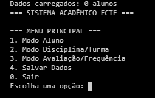
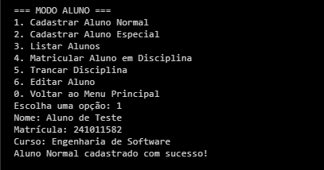
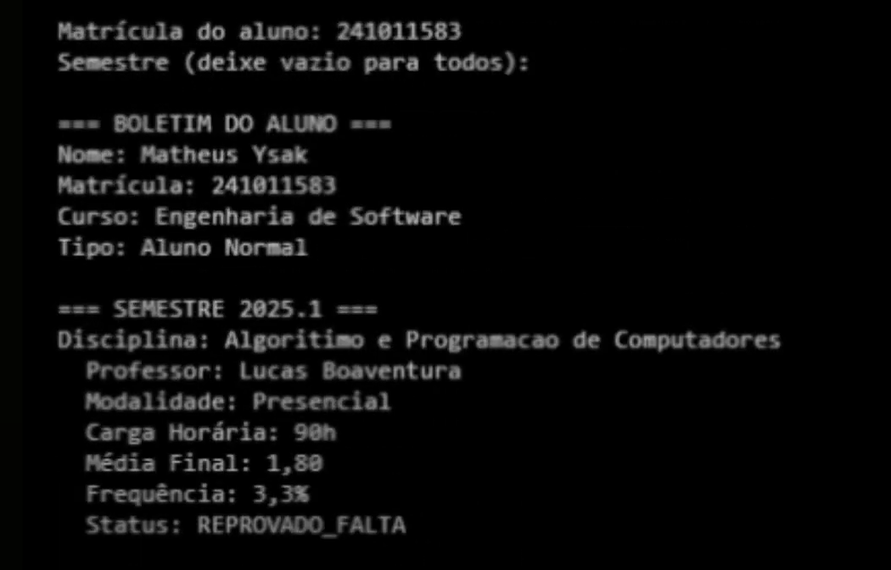

# Sistema Acadêmico - FCTE

## Descrição do Projeto

Desenvolvimento de um sistema acadêmico para gerenciar alunos, disciplinas, professores, turmas, avaliações e frequência, utilizando os conceitos de orientação a objetos (herança, polimorfismo e encapsulamento) e persistência de dados em arquivos.

O enunciado do trabalho pode ser encontrado aqui:
- [Trabalho 1 - Sistema Acadêmico](https://github.com/lboaventura25/OO-T06_2025.1_UnB_FCTE/blob/main/trabalhos/ep1/README.md)

## Dados do Aluno

- **Nome completo:** Pedro Henrique Monteiro Nascimento
- **Matrícula:** 241011582
- **Curso:** Engenharias (3º Semestre)
- **Turma:** T06 2025.1


## Vídeo de Demonstração

- [Video](https://youtu.be/GeE-cne07RI)


## 🚀 Como Executar

### Pré-requisitos
- Java 8 ou superior
- Sistema operacional com terminal/prompt de comando

### Compilação e Execução

1. **Estrutura de pastas necessária:**
```
sistema-academico/
├── model/
│   ├── Pessoa.java
│   ├── Aluno.java
│   ├── AlunoEspecial.java
│   ├── Professor.java
│   ├── Disciplina.java
│   ├── Turma.java
│   └── AvaliacaoFrequencia.java
├── util/
│   └── GerenciadorDados.java
├── SistemaAcademico.java
├── compilar.bat (Windows)
├── compilar.sh (Linux/Mac)
├── dados/ (criada automaticamente)
└── assets/ (documentação)
```

2. **Para Windows:**
```batch
# Execute o arquivo compilar.bat
compilar.bat

# Ou compile manualmente:
javac -d . modelo/*.java util/*.java SistemaAcademico.java
java SistemaAcademico
```

3. **Para Linux/Mac:**
```bash
# Dê permissão e execute:
chmod +x compilar.sh
./compilar.sh

# Ou compile manualmente:
javac -d . model/*.java util/*.java SistemaAcademico.java
java SistemaAcademico
```

---

## Prints da Execução

<div style="display: flex; flex-direction: column; gap: 20px; align-items: center;">
    <div style="text-align: center;">
        1. Menu Principal:<br>
        
    </div>
    <div style="text-align: center;">
        2. Cadastro de Aluno:<br>
        
    </div>
    <div style="text-align: center;">
        3. Relatório de Frequência/Notas:<br>
        
    </div>
</div>


## Principais Funcionalidades Implementadas

- [x] Cadastro, listagem, matrícula e trancamento de alunos (Normais e Especiais)
- [x] Cadastro de disciplinas e criação de turmas (presenciais e remotas)
- [x] Matrícula de alunos em turmas, respeitando vagas e pré-requisitos
- [x] Lançamento de notas e controle de presença
- [x] Cálculo de média final e verificação de aprovação/reprovação
- [x] Relatórios de desempenho acadêmico por aluno, turma e disciplina
- [x] Persistência de dados em arquivos (.txt ou .csv)
- [x] Tratamento de duplicidade de matrículas
- [x] Uso de herança, polimorfismo e encapsulamento

---

## Observações (Extras ou Dificuldades)
> Eu usei essa parte da documentação como anotações para estudo 

Em relação as bibliotecas que eu necessitei revisar e ler para a realização do projeto está a da funcionalidade de salvamento genérico usando Generics, que permite gravar listas de qualquer tipo (alunos, professores, disciplinas) em arquivos separados. Usei `FileWriter`, `PrintWriter` e `Scanner` para fazer a leitura e escrita, além de criar automaticamente os diretórios quando necessário. As bibliotecas padrão do Java ajudaram bastante a evitar código repetitivo e deixaram o sistema mais alinhado as boas práticas. O uso de coleções como `ArrayList` e `HashMap`, junto com o tratamento de exceções, deixou tudo mais direto e evitando redundância.

Durante a realização do projeto, uma das maiores dúvidas que enfrentei foi sobre a ideia de criar uma pasta `services` para organizar os métodos de manipulação de dados. Na maioria dos projetos de software há uma separação entre controller, view e model. Entretanto o professor explicou que isso foge do padrão de orientação a objetos (não só no escopo da linguagem e da programação, mas como metodologia de software mesmo), já que cria uma separação de responsabilidades que lembra o padrão MVC (Model, View e Controller) ou arquitetura em camadas — que não era o foco do trabalho.

Na metodologia de orientação a objetos, os comportamentos devem estar junto dos dados. Por exemplo, as próprias classes `Aluno`, `Professor`, `Disciplina` poderiam conter a lógica de salvar e carregar, ou essa responsabilidade poderia estar em alguma classe controladora que lida diretamente com o fluxo do sistema. Ao criar `services`, sem perceber, eu estava aplicando uma estrutura mais voltada ao MVC, onde a lógica de negócio fica isolada, fora do escopo da classe. 

O meu primeiro contato com projetos reais foi direto com o NestJS, um framework Node.js, que depois de revisitar os conceitos descobri que ele é um MVC mas ainda mais modular, alinhando com as metodologias macro (sistemas distribuidos) e micro (microserviços), além de adotar a metodologia SOLID, então quando o professor pediu para não criar a pasta `services` miha cabeça explodiu tentando entender o porque não. Entretanto, até o presente momento ainda não li nem estudei acerca da otimização e da diferença entre essas duas metodologias (OO e MVC) em relação a escalabilidade, confiabilidade e tempo de resposta, por mais que a maioria dos sistemas comerciais e afora no mercado de trabalho utilizem a metodologia MVC, talvez em bancos (muito comum ser o principal mercado de tecnologia de brasília) faça mais sentido permanecer no OO.
# 

> SOLID (cada classe tem uma responsabilidade única (S), é aberta para extensão mas fechada para modificação (O), permite substituição segura de implementações (L), separa claramente as responsabilidades (I) e usa injeção de dependência por padrão (D) - Traduzido)

# 
A dificuldade foi justamente entender por que isso não era recomendado nesse contexto. Pensando na organização, separar tudo em `services` parecia mais limpo, mas aos poucos fui entendendo que, nesse caso, cada objeto deve ser responsável pelo seu próprio comportamento. O projeto, apesar de ter a pasta model e utilites, não usou MVC, e ficou claro que o foco era trabalhar com encapsulamento e responsabilidade bem distribuída entre as próprias classes, sem dividir tudo em camadas.


---

## Contato

- [nascimento.monteiro@aluno.unb.br]
